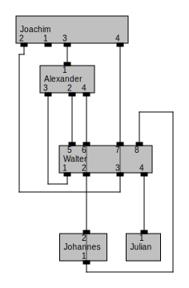

# praline-core

## What is this library about?

This is a Java library (built with maven) for generating drawings of graphs/networks.
In partiuclar, it is designed for layer-based drawings (sometimes called Sugiyama-style drawings) where the vertices can have ports and there can be additional constraints on the ports.
It can be used for generating layouts of cable plans, schematic circuit diagrams, network maps, UML diagrams, etc.
Moreover, as a minor part, it contains tools for generating force-directed drawings of graphs based on the JUNG project.

## Structure of the project

The praline-core Java project contains four parts.

### Praline-Data-Structure

Here are classes that define the graphs/networks being processed in our layered drawing algorithm.
The top-level object we work with is a defined in the class ``Graph``, which represents a network.
It contains ``vertices`` (the nodes of the network), maybe some ``vertexGroups`` (containig nodes of the network or further vertexGroups), ``edges`` (the links between pairs of nodes in the network), and maybe some ``edgeBundles`` (containig edges of the network or further edgeBundles).
In turn, an object of the class ``Vertex`` can contain ports or port groups (to refer to both, we use the interface ``PortComposition``).
To add a ``PortPairing``, use the class ``VertexGroup``.
Note that objects of ``Shape`` and ``Path`` do not need to be specified as part of the input (can be ``null``), but they are set by the graph drawing algorithm and in the end they host the spatial information of the layout.
For classes extending ``ReferenceObject`` and ``PropertyObject``, you can attach data for identifiying your objects.
The following UML diagram describes our data structure. We refer to this data structure as the ``praline`` format.

### Praline-Layouting

Here are the classes of our drawing algorithm, which are the algorithmic core of this project.
On the top level, there is the (generic) interface PralineLayouter, which shall get a graph in the ``praline`` format and potentially an instance of ``DrawingInformation``
and shall generate a drawing of the input graph by adding spatial information (i.e., coordinates and sizes of the nodes and descriptions of the curves/segments representing the edges).
The top-level has two subdirectories: ``layered`` and ``force``.
The latter is just a stumb that is not implemented (it is a place holder for a force-directed graph drawing algorithm that works with the ``praline`` format and also respects the input port constraints).
The former contains an algorithm for drawing a graph on layers while respecting certain port constraints that may be part of the input graph.
The layouter is called ``SugiyamaLayouter`` because the algorithm behind is an extension of the classical layer-based graph drawing approach by Sugiyama, Tagawa and Toda.
There is also a folder providing import and export functionality of the ``praline`` format to the ``KIELER`` (now known as ``eclipse elk``) library for layer-based graph drawing with ports.
The following simple example layout has been generated with our layer-based graph drawing algorithm.

### Praline-IO

Here are classes for importing to and exporting from the ``praline`` format.
Currently, you can import graphs in the GraphML and JsForceGraph format.
However, you may want to write your own importer handling your specific graph/network format and translating it to a corresponding instance in the ``praline`` format.
You can export the resutling drawing from the ``praline`` format to an svg file or to the JsForceGraph format.
You can also retrieve the added spatial information in the ``praline`` graph by iterating over the nodes, ports and edges.

### Jung-Layouting

Here are classes for force-directed graph drawing using standard techniques, well-separated pair decompositions (wspd) and quadtrees.
Note that this is taken from an older project that is *not* based on the ``praline`` format but on ``JUNG``, which is a library for graph (drawing) algorithms in Java.
In particular, in this format there are no ports.
One of the force-directed graph drawing algorithms is used as a subroutine in the layer-based graph drawing algorithm within ``Praline-Layouting``.

## How to use?

#### 1. Download the content of this git repository.

On the command line, you can do this by using

~~~
git clone https://github.com/WueGD/praline-core.git
~~~

Alternatively, use your favorite git tool or download the zip file via your web browser and unpack it afterwards.

#### 2. Build the project with maven.

On the command line, enter the top-level directory of this project (where also readme file lies) and use

~~~
mvn clean package
~~~

or, to use it as an dependency elsewhere on your local machine,

~~~
mvn clean install
~~~

Alternatively, if you use an integrated development environment (IDE), import this as a maven project.

#### 3. Generate a test drawing.

If you work on the command line, you can use

~~~
java -jar Praline-Layouting/target/Praline-Layouting-YOUR.DOWNLOADED.VERSION-jar-with-dependencies.jar
~~~

to generate an svg file showing a drawing of a small network being used as an initial example in our journal article (see below).
You can also add an individual path to a json file in the ``praline`` format.
There are a few examples in ``Praline-Layouting/data/example-very-small`` and ``Praline-Layouting/data/example-cgta/``.

So, try also, e.g.,

~~~
java -jar Praline-Layouting/target/Praline-Layouting-YOUR.DOWNLOADED.VERSION-jar-with-dependencies.jar Praline-Layouting/data/example-very-small/praline-pseudo-plan-0e59d04df679e020.json
~~~

or

~~~
java -jar Praline-Layouting/target/Praline-Layouting-YOUR.DOWNLOADED.VERSION-jar-with-dependencies.jar Praline-Layouting/data/example-cgta/diagram_0058-praline.json
~~~

This calls the main method in the class ``MainDrawSinglePlan``, which you may also do via your IDE.
To generate drawings for all jsons in a directory, use the main method in the class ``MainDrawPackage``.

#### 4. Get more graphs.

Get larger data sets of networks in the ``praline`` format from the pseudo-praline-plan-generation project (see below)
or from downloading the graphs from, e.g., [topology zoo](http://topology-zoo.org/) in the GraphML format and importing them to the ``praline`` format
or from importing your own data to the ``praline`` format.

#### 5. Modifying the style of the generated drawings

The main methods in ``MainDrawSinglePlan`` and ``MainDrawPackage`` use ``SugiyamaLayouter`` to generate a layer-based graph drawing.
To instances of ``SugiyamaLayouter``, you can pass, besides the graph object in the ``praline`` format, an object of ``DrawingInformation`` (located in the part ``Praline-IO``).
There you can slightly modify the style of your generated drawings (the output svgs).
E.g., you can change the default vertex height, distance between ports/layers/edges, port size, toggle whether you want to show port groups, port pairings, port labels, etcs.
To get an overview and to try out modifications of the default parameters, the best way is to inspect the source code in an IDE.

## Related repositories

- [praline-pseudo-plans](https://github.com/WueGD/praline-pseudo-plans)
- [wueortho](https://github.com/WueGD/wueortho)

## Creators and contact

This library has been developed by people from
- [chair I (algorithms and complexity group)](https://www.informatik.uni-wuerzburg.de/algo/team/), institute of computer science, University of Würzburg, Germany,
- [denkbares GmbH](https://www.denkbares.com/), Würzburg, Germany, and
- [Infosim GmbH & Co. KG](https://www.infosim.net/), Würzburg, Germany.

For contact, you can write an email to ``praline *at* informatik *dot* uni-wuerzburg *dot* de``.

 &nbsp;&nbsp;&nbsp;&nbsp;&nbsp;&nbsp;  &nbsp;&nbsp;&nbsp;&nbsp;&nbsp;&nbsp; 

## Funding

Substantial parts of this library were developed in the context of the project iPRALINE – grant ZF4117505 (interaktive Problemanalyse und -lösung in komplexen industriellen Netzwerken)
from 2019–2021, which has been funded by the German Federal Ministry for Economic Affairs and Energy as part of the ZIM (Zentrales Innovationsprogramm Mittelstand) funding program.

## Publications

Parts of this code are described in the following publications.

### Layer-based drawings with ports

#### Full journal version:

Johannes Zink, Julian Walter, Joachim Baumeister, and Alexander Wolff.
Layered drawing of undirected graphs with generalized port constraints.
*Computational Geometry*, 105–106:101886, 2022.
[doi:10.1016/j.comgeo.2022.101886](https://doi.org/10.1016/j.comgeo.2022.101886), [arxiv:2008.10583](https://arxiv.org/abs/2008.10583).

#### Preliminary conference version:

Julian Walter, Johannes Zink, Joachim Baumeister, and Alexander Wolff.
Layered drawing of undirected graphs with generalized port constraints.
In *Proc. 28th International Symposium on Graph Drawing & Network Visualization (GD’20)*, pages 220–234.
Springer, 2020.
[doi:10.1007/978-3-030-68766-3_18](https://doi.org/10.1007/978-3-030-68766-3_18).

### Force-directed graph drawing with the well-separated pair decompositions

#### Full journal version:

Fabian Lipp, Alexander Wolff, and Johannes Zink.
Faster force-directed graph drawing with the well-separated pair decomposition.
*Algorithms*, 9(3), 2016.
[doi:10.3390/a9030053](https://doi.org/10.3390/a9030053).

#### Preliminary conference version:

Fabian Lipp, Alexander Wolff, and Johannes Zink.
Faster force-directed graph drawing with the well-separated pair decomposition.
In *Proc. 23rd International Symposium on Graph Drawing & Network Visualization (GD’15)*, pages 52–59.
Springer, 2015.
[doi:10.1007/978-3-319-27261-0_5](https://doi.org/doi:10.1007/978-3-319-27261-0_5).

